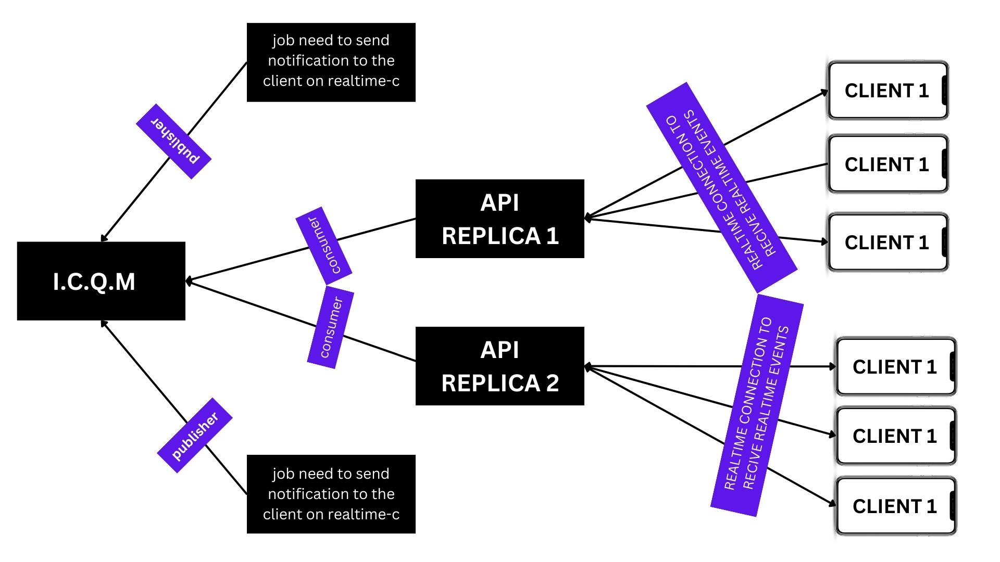

# inter-cluster-queue-manager

> NOTE : see [inter-cluster-queue-manager-client](https://github.com/midoelhawy/inter-cluster-queue-manager-client) for more info about how to use client

### **Use case :**

This project was implemented to solve the poblem of data communication between applications/replicas in a cluster.

In my case, I needed to get update events to the clients. But in fact, the api/application where the clients connected is replicated, so the client could be connected to one of the N replicas available.
As is shown in this graphic :



In the example, the job updates some entities and needs to send the update to one of the connected clients.

Now the job will send the event to I.C.Q.M on topic X, where the API replicas are connected as consumers.
The API will send the received events to the correct connected client.

### How to use it:

To use the project you can sempy do it by [docker image](https://hub.docker.com/r/midoelhawy/inter-cluster-queue-manager)

by network `host`

```bash
sudo docker run --name inter-cluster-queue-manager-server -tid --network host  midoelhawy/inter-cluster-queue-manager:latest
```

by exposing port

```bash
sudo docker run --name inter-cluster-queue-manager-server -tid -p 3600:3600  midoelhawy/inter-cluster-queue-manager:latest
```
